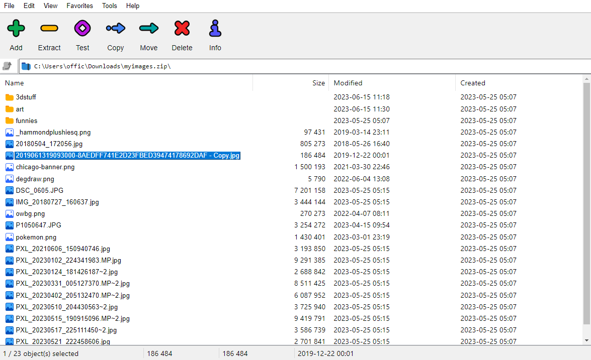

# myimages.zip



myimages.zip is a parody of 7zip File Manager's UI. Explore a file directory in your web browser and look at some of my images.

## Project Setup

After cloning this repository and installing the dependencies, you'll need to generate the file directory data used by the website. Grab some of the images you want people to see and put them in the `/public` directory.

Afterwards, run the following commands in the `/script` directory:

```bash
node metadata_cleanup.js
node data_generator.js
```

These two commands will clean any geolocation data on your images and generate the file directory data. Move the generated `FINAL_DATA.json` file to the `/internals` directory.

Now, you can run the development server:

```bash
npm run dev
# or
yarn dev
# or
pnpm dev
```

Open [http://localhost:3000](http://localhost:3000) with your browser to see the result.

This project uses Next.js. You can start editing the page by modifying `app/page.tsx`. The page auto-updates as you edit the file.

To learn more about Next.js, take a look at the following resources:

- [Next.js Documentation](https://nextjs.org/docs) - learn about Next.js features and API.
- [Learn Next.js](https://nextjs.org/learn) - an interactive Next.js tutorial.
